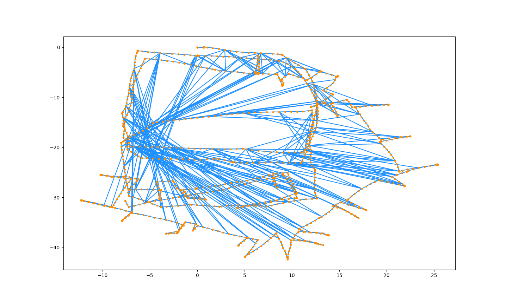

# Graph SLAM

> An implementation of 2D graph based SLAM, tested on [Luca Carlone's Dataset](https://lucacarlone.mit.edu/datasets/)

Intel Dataset Before Optimization |  After optimization
:-------------------------:|:-------------------------:
 | 

## Requirements

This repo uses [uv](https://github.com/astral-sh/uv) as the Python package manager. You can follow the guide to install it [here](https://docs.astral.sh/uv/getting-started/installation/)

## Quick Start

Clone the repo and run (in root project folder)
```sh
# install project dependencies into a virtual env
uv sync

# run the project with the virtual env
uv run main.py
```

By default, `main.py` will run the Intel dataset. To run other ones, simply change the path in `main.py`

```python
g = Graph.from_g2o("./dataset/input_INTEL_g2o.g2o")

```
